## Create EKS Cluster through Management Console (UI)

Setup Kubernetes cluster on AWS using a managed service called EKS (Elastic Kubernetes Service).


### Steps to create EKS cluster:

These are the high level steps we will follow to setup EKS cluster:

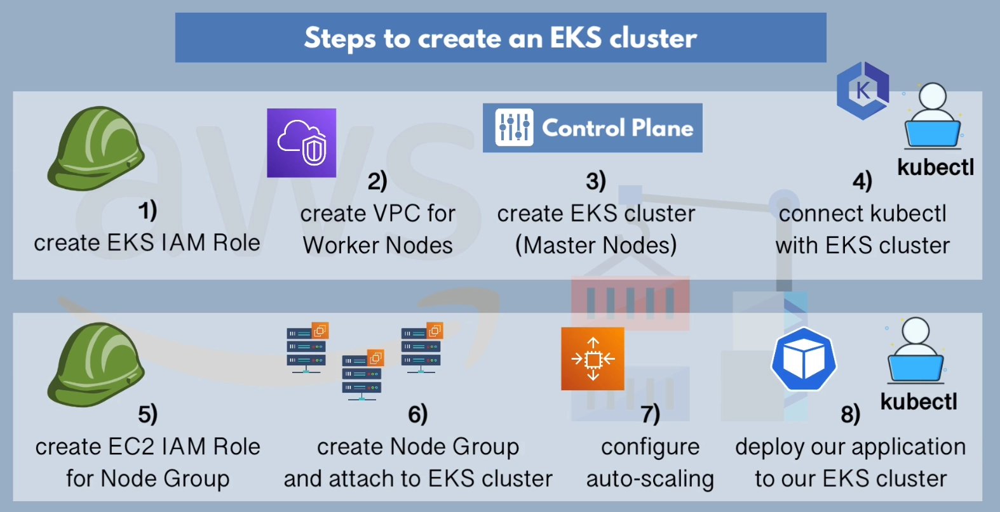


### Step 1: Create EKS IAM Role

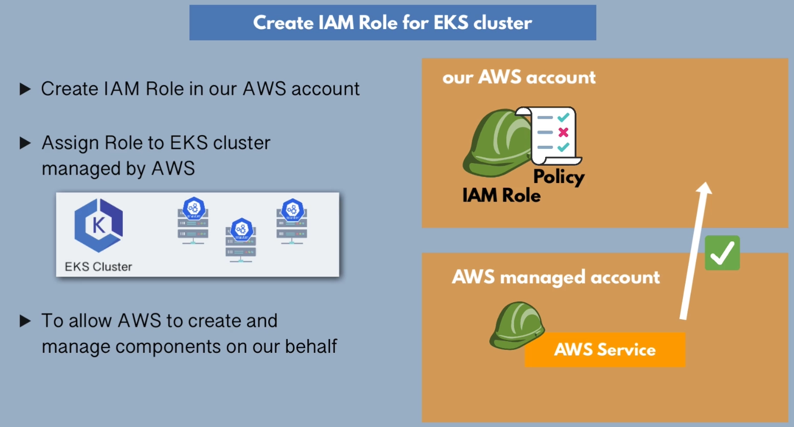

Specify Trust policy for your EKS Role. Since, EKS will consume this role, select EKS from use case dropwdown and choose EKS cluster option.

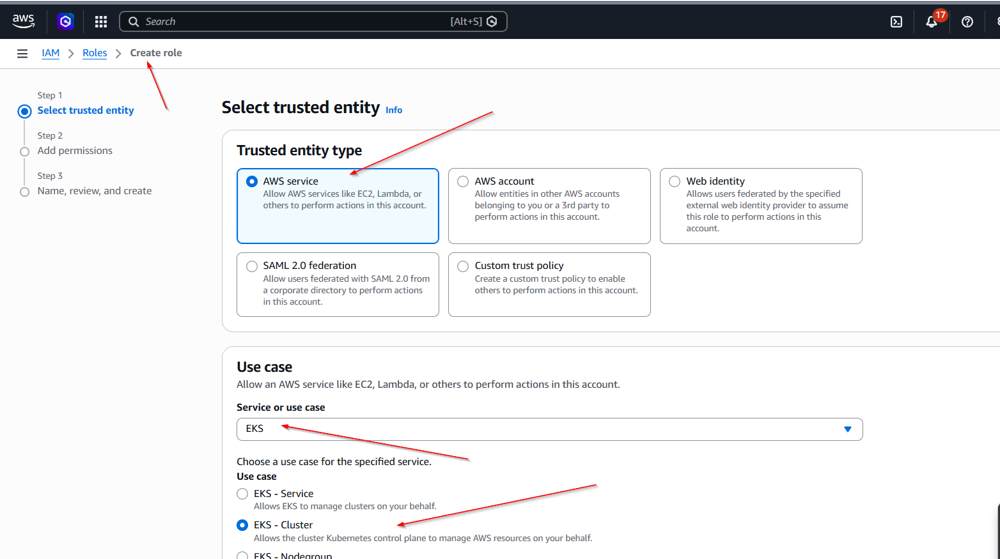


Based on the use case you have selected in the previous, it will automatically select permission policy for you. Click Next to Continue.

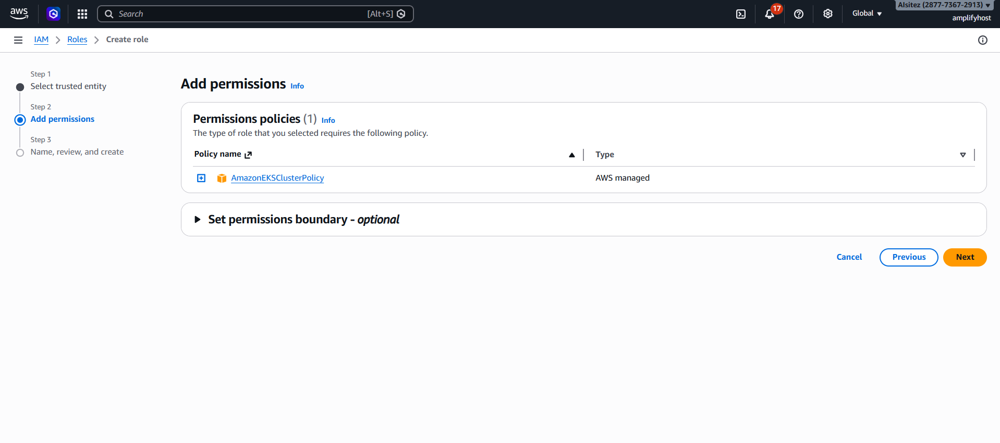


Review and Name your EKS cluster to create Role.

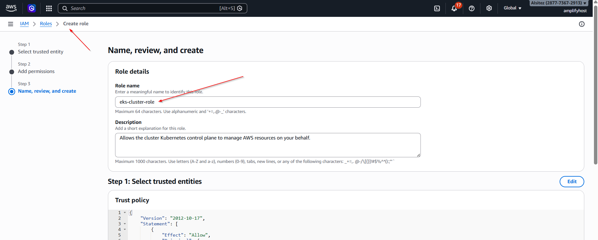


### Step 2: Create VPC for worker nodes

First of all, we cannot use default VPC provided by AWS in each region for our Kubernetes cluster.

EKS cluster needs a specific configuration of networking for it to work without problem. You have to remember that EKS is based on the Kubernetes. So, Kubernetes has its own networking rules and AWS, on top of that, has its own networking rules. These two need to work together. 

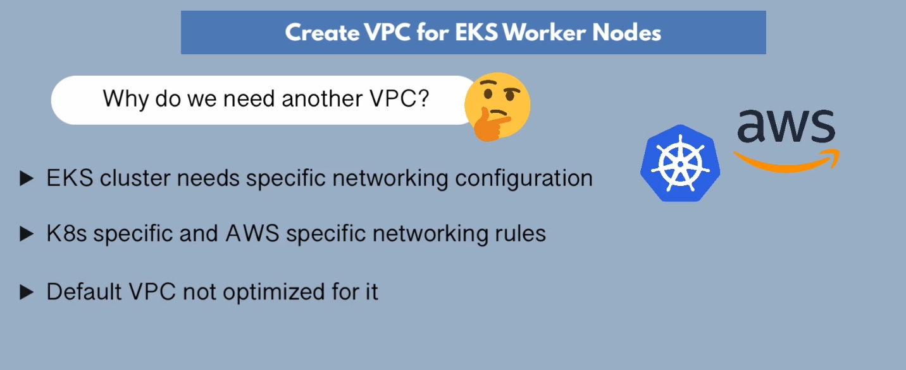

Worker Nodes, which are going to run in your VPC in different subnets, need to have a set of firewall configurations that are necessary for master nodes to connect to the worker nodes and manage them.

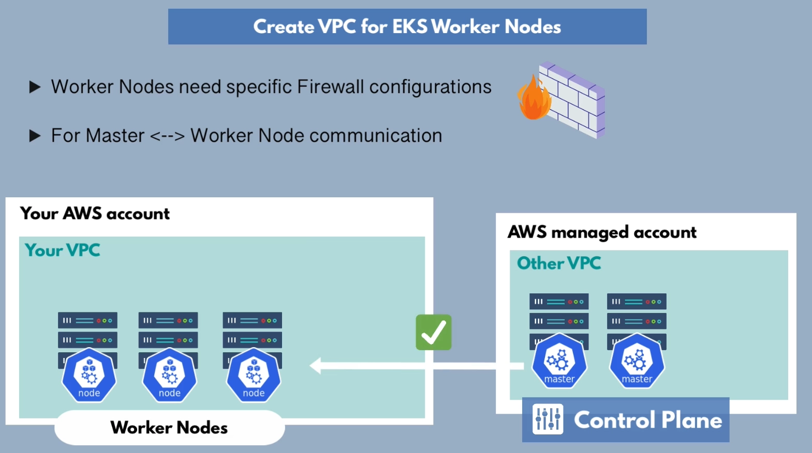

Instead of creating this custom VPC manually through UI, we will use Cloudformation template provided by AWS to create VPC for worker nodes with best practices.

Here is the CloudFormation template link:

```bash
https://s3.us-west-2.amazonaws.com/amazon-eks/cloudformation/2020-10-29/amazon-eks-vpc-private-subnets.yaml
```
Go the the CloudFormation Console and create a stack from this template.

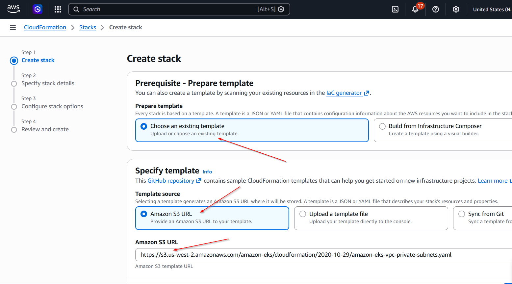

Name your stack and keep all the default parameter values as it is. For the rest of the steps, Click next and create stack

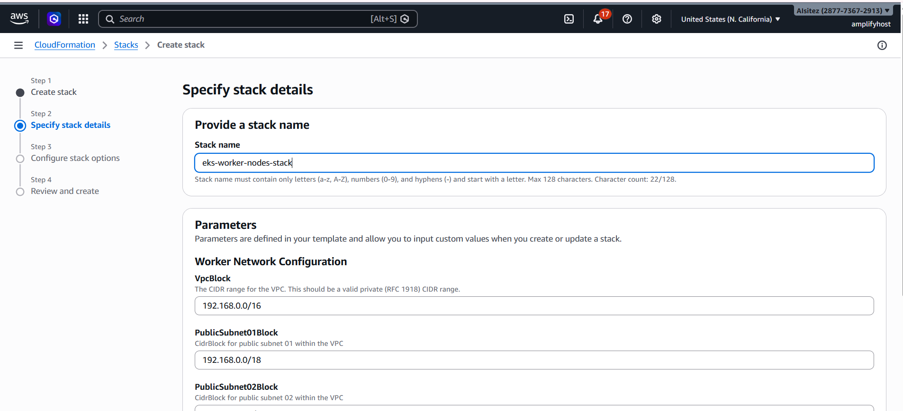

The Stack has been created successfully.

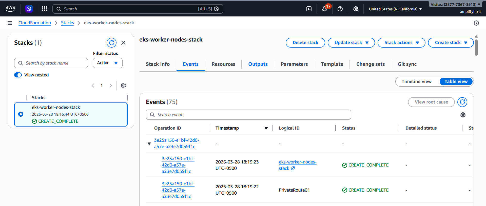


### Step 3: Create EKS Cluster

Go to the EKS service console and click "Create Cluster" button to create cluster.

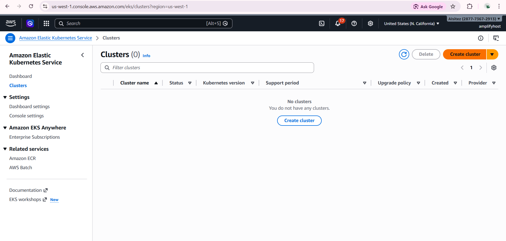

Choose Custom configuration setup option instead of quick. Name your cluster and select the IAM role that we created in the step 1.

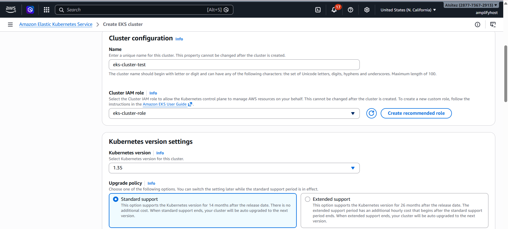


In the networking step, select your VPC that you created in the second step of this guide. When you select your VPC, it will automatically all the Public and Private subnets. Don't forget to select security group that enable communication from master control plane to custom VPC.

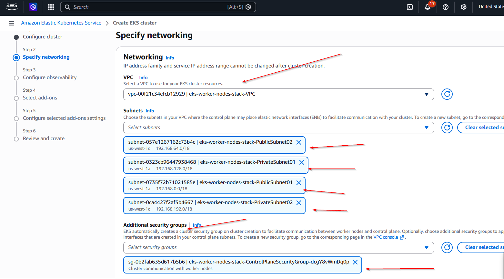


Public endppoint means if you want to access your cluster from outside the VPC. For example, you want to interact with EKS cluster using `kubectl` client.

Private endpoint will allow your worker node to access master node without going through the Public internet route.

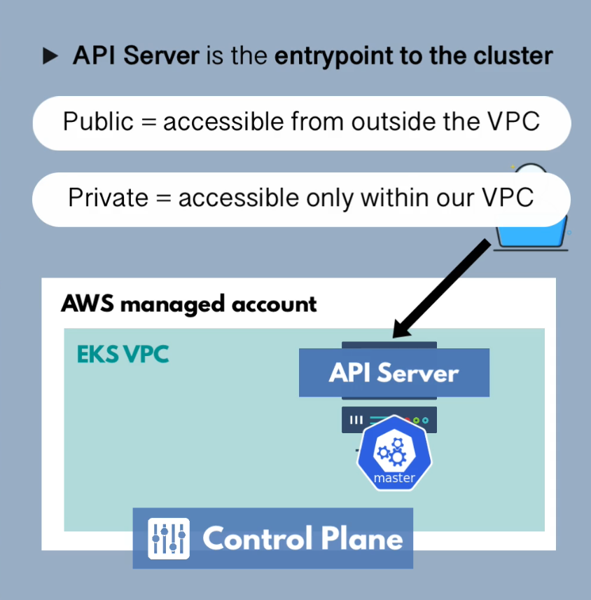

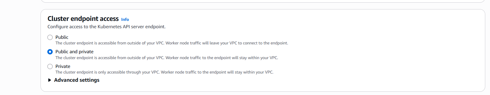

For the rest of the steps, keep clicking next button until you reach the final step and then, click create to create the cluster.

The EKS cluster has been created successfully after approximately 10 minutes.

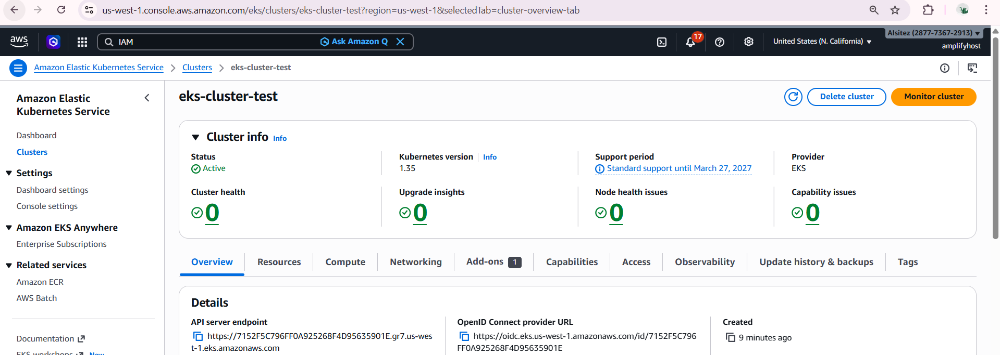


### Step 4: Connect kubectl with EKS

Update a `kubeconfig` file using the following command by using cluster name that you speicified while creating EKS cluster

```bash
aws eks update-kubeconfig --name eks-cluster-test
```

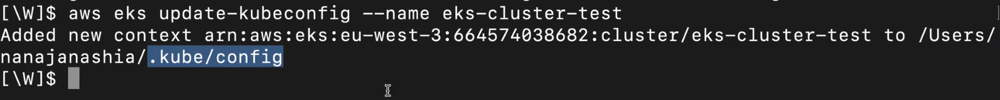

```bash
kubectl get nodes
```
```bash
kubectl cluster-info
```


### Step 5: Create EC2 IAM role for node group

Specify Trust policy for your EC2 Role. Since, EC2 will consume this role, select EC2 from use case dropwdown.

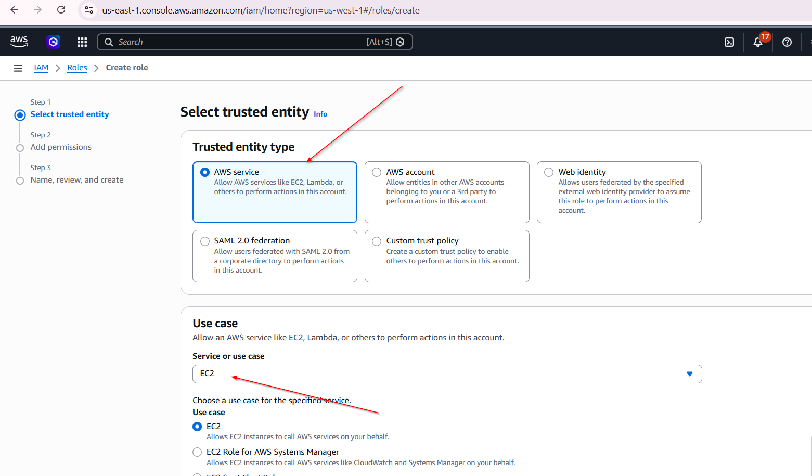

Select 3 AWS Managed Permission policies to attach to this role.

1. AmazonEKSWorkerNodePolicy
2. AmazonEC2ContainerRegistryReadOnly
3. AmazonEKS_CNI_Policy

Review and Name your EKS cluster to create Role.

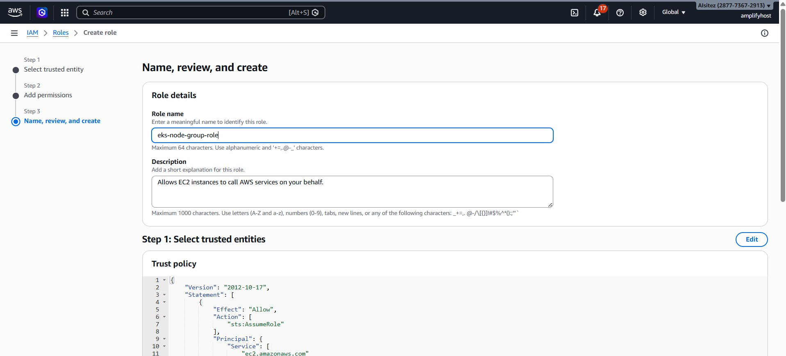


### Step 6: Create EKS node group

Under the compute tab of the your cluster, you will see a section to create new node group for your EKS cluster.

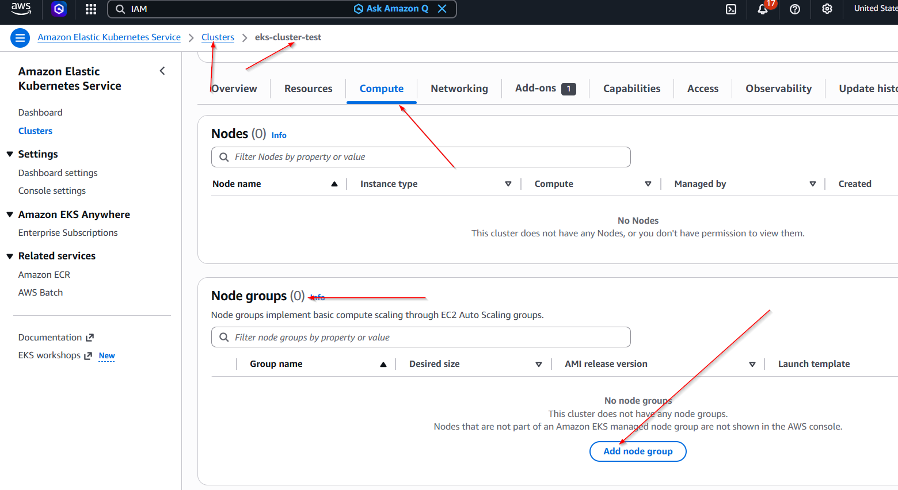

Name your node group and select EC2 IAM role that we created in the previous of this guide.

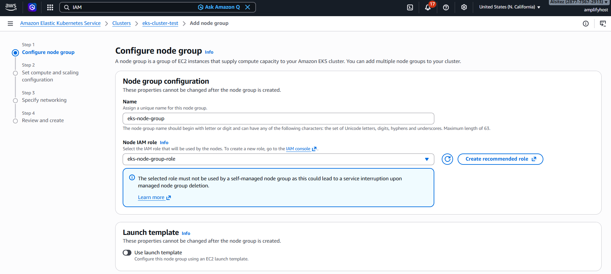

The purpose of the Node Group is to spin up EC2 instances based on the configuration you have specified. So, Specify EC2 instances configuration here.

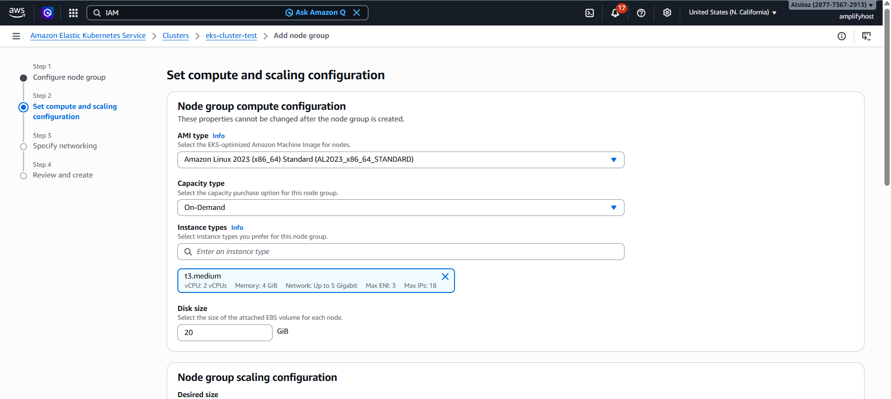