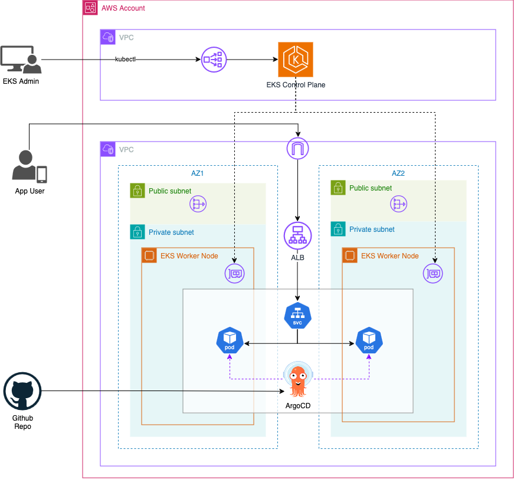
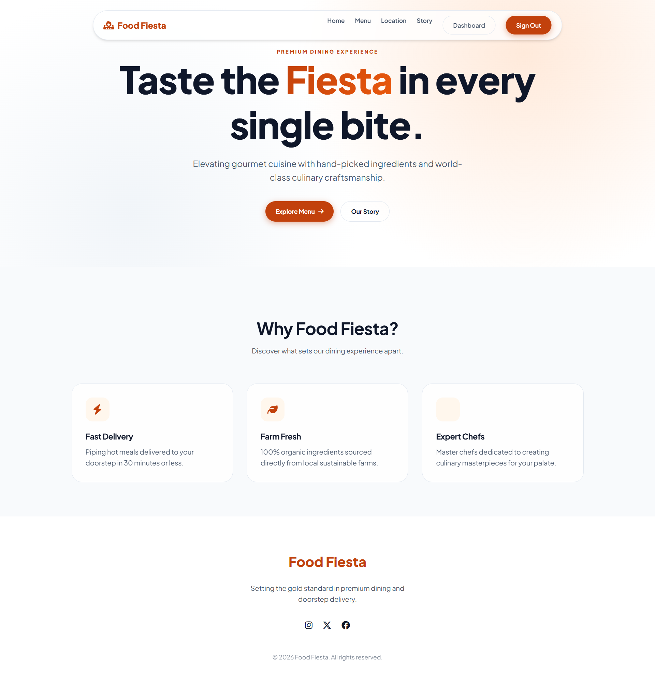
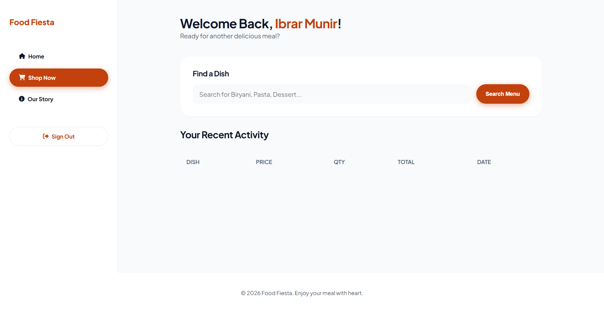
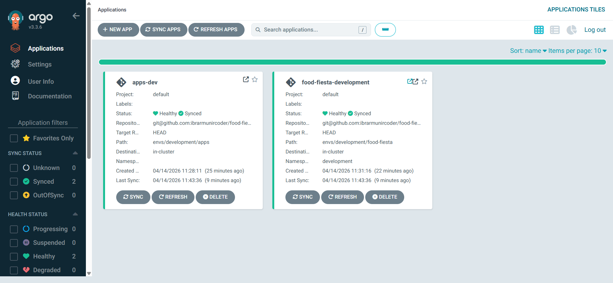
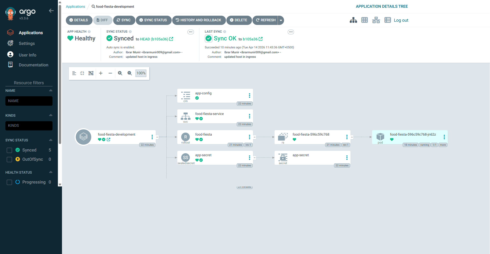
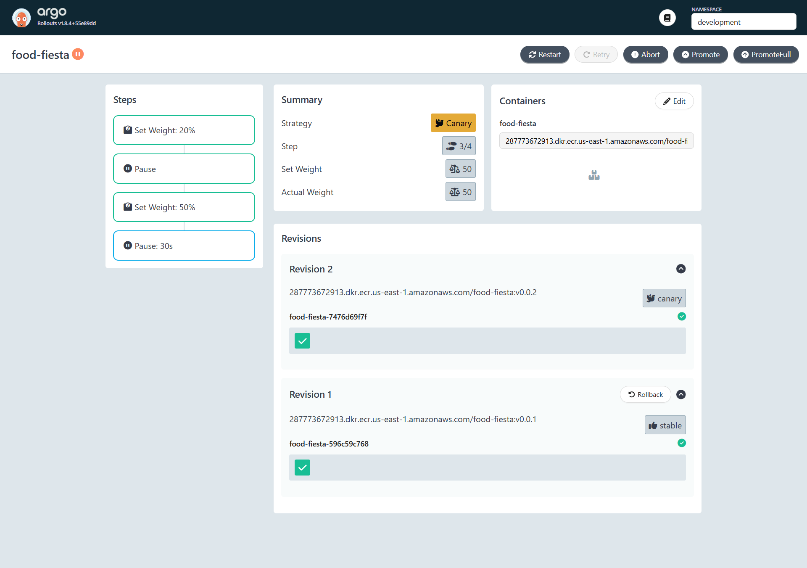

## 🍽️ Food Fiesta - Cloud-Native Spring Boot App on AWS EKS using Terraform, GitOps & CI/CD

### 📌 Project Overview:

The Food Fiesta project is a **cloud-native**, full-stack food ordering application built with **Spring Boot** and deployed to **AWS EKS** using a modern **GitOps** workflow. The project serves as a comprehensive demonstration of Infrastructure as Code (IaC) with **Terraform**, automated CI/CD via **GitHub Actions**, and progressive delivery using **ArgoCD and Argo Rollouts**.

---

### ☁️ AWS Services Used

- Amazon EKS (Elastic Kubernetes Service)
- Amazon EC2
- Application Load Balancer (ALB)
- Amazon VPC
- Amazon RDS (PostgreSQL)
- Auto Scaling Group (ASG)
- AWS Systems Manager (Parameter Store)
- Amazon ECR
- AWS IAM
- NAT Gateway
- Amazon S3

---

### 🛠️ Tech Stack

- **Backend:** Java, Spring Boot  
- **Build Tool:** Maven  
- **Database:** PostgreSQL  
- **Infrastructure:** Terraform  
- **Containerization:** Docker, Docker Compose  
- **CI/CD:** GitHub Actions  
- **GitOps:** ArgoCD, Argo Rollouts  
- **Orchestration:** Kubernetes (EKS)  

---

### Architecture Diagram:

---

## 🚀 High Level Steps

1. Executed the **Spring Boot application** locally to understand project requirements such as Java version, Maven version, configuration variables, and database setup  
2. **Containerized** the application using **Docker** by creating a Dockerfile  
3. Built a **GitHub Actions CI pipeline** to automate build, test, packaging, and pushing images to **Amazon ECR**  
4. Provisioned complete **AWS infrastructure** using **Terraform**, including EKS, VPC, and RDS  
5. Automated **Helm-based deployments** via Terraform for cluster components:
   - ArgoCD Server  
   - ArgoCD Image Updater  
   - Argo Rollouts  
   - AWS Load Balancer Controller (Ingress)  
6. Created **Kubernetes manifests** and an **ArgoCD Application** for GitOps-based continuous delivery  
7. Validated the complete workflow end-to-end from code commit → CI pipeline → automatic deployment to EKS via ArgoCD  

---

### ✨ Key Features

- End-to-end **CI/CD automation** from code commit to production deployment  
- **GitOps-based deployment** using ArgoCD with automatic synchronization  
- Automated **container image updates** using ArgoCD Image Updater (Git write-back method)  
- **Progressive delivery** using Argo Rollouts (canary / blue-green strategies)  
- Implementation of **ArgoCD App of Apps pattern** for scalable application management  
- Secure secret management using **Kubernetes Sealed Secrets**  
- Fully **containerized application** using Docker  
- Scalable and production-ready deployment on **AWS EKS**  
- Infrastructure provisioning using **Terraform (IaC)**  
- Automated **Helm deployments** via Terraform Helm Provider  
- Secure configuration management using **AWS Systems Manager (Parameter Store)**  
- TLS-enabled Ingress using **AWS Certificate Manager (ACM)**  
- External traffic routing via **AWS Load Balancer Controller (Ingress)**  

---

## 🎯 Learning Objectives

- Understand how to design and implement a **cloud-native application architecture**  
- Gain hands-on experience with **Infrastructure as Code (Terraform)**  
- Learn to build and manage **CI/CD pipelines using GitHub Actions**  
- Implement **GitOps workflows** using ArgoCD  
- Explore **Kubernetes concepts** including deployments, services, and ingress  
- Learn **containerization best practices** using Docker  
- Understand **progressive delivery techniques** with Argo Rollouts  
- Gain practical experience deploying applications on **AWS EKS**  
- Understand how **ArgoCD Image Updater Git write-back method** works  
- Integrate **Kubernetes Sealed Secrets** to encrypt sensitive data for safe storage in Git  
- Learn how to configure the **Terraform Helm Provider** to authenticate with AWS EKS  
- Implement the **ArgoCD App of Apps pattern** for managing multiple applications  
- Integrate **AWS Certificate Manager (ACM)** certificates with Kubernetes Ingress using annotations  
- Understand the difference between **IP mode and Node mode** in AWS Load Balancer Controller  

---

### 🎬 Live Demo:

Argo Rollout Dashboard to monitor and rollout new application version safely

---

### 👨‍💻 Connect with me:

**Ibrar Munir**

Github: https://github.com/ibrarmunircoder  
LinkedIn: https://www.linkedin.com/in/ibrar-munir-53197a16b  
Portfolio: https://ibrarmunir.d3psh89dj43dt6.amplifyapp.com